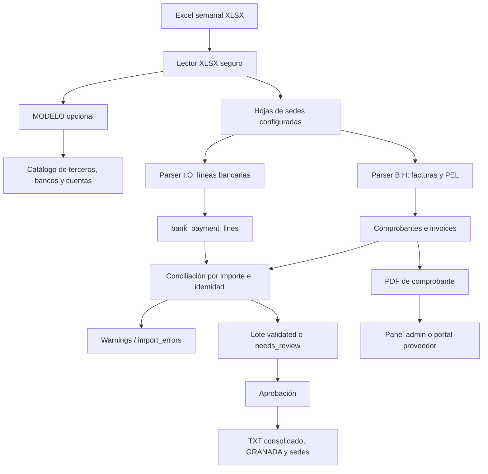

# Documentación técnica y de operación

## 1. Propósito

Payment Receipts AG es una aplicación web para centralizar el ciclo semanal de pagos a proveedores de Mister Wings:

1. Recibe un libro de Excel con información de una o varias sedes.
2. Lee el catálogo opcional de la hoja `MODELO`.
3. Interpreta el detalle de facturas y comprobantes.
4. Interpreta las referencias bancarias de cada sede.
5. Concilia comprobantes con líneas bancarias usando importe e identidad del tercero.
6. Registra advertencias sin ocultar los datos importados.
7. Genera un TXT consolidado para el banco y archivos separados por sede.
8. Genera comprobantes PDF para el panel administrativo y para el portal de proveedores.

Esta documentación describe la implementación actual, no un diseño idealizado. Las decisiones operativas importantes y las limitaciones conocidas están al final del documento.

## 2. Resumen ejecutivo

### 2.1 Stack

| Capa | Tecnología | Versión o detalle |
|---|---|---|
| Backend | PHP y Laravel | PHP 8.4, Laravel 13 |
| Frontend | Vue, Inertia y Vite | Vue 3, `@inertiajs/vue3`, Vite |
| Estilos | Tailwind CSS | Tailwind 4 mediante `@tailwindcss/vite` |
| Base de datos | PostgreSQL | PostgreSQL 17 en Docker |
| PDF | Dompdf | `barryvdh/laravel-dompdf` |
| Entrada Excel | Implementación propia | `ZipArchive`, `XMLReader` y `SimpleXML`; no se usa PhpSpreadsheet |
| Desarrollo | Docker Compose | Servicios `app`, `node`, `postgres` y `pgadmin` |

Dependencias y scripts: `src/composer.json` y `src/package.json`. La orquestación está en `docker-compose.yml`.

### 2.2 Componentes principales

- `Actions`: coordinan casos de uso completos.
- `Excel`: abre libros XLSX con controles de seguridad.
- `Parsers`: convierten hojas o bloques del Excel en DTO.
- `Importers`: sincronizan el catálogo y persisten pagos.
- `DTO`: transportan datos parseados sin acoplar el parser a Eloquent.
- `Support`: normaliza importes, fechas, identificadores y nombres.
- `Formatters`: convierten las líneas bancarias a TXT tabulado.
- `Models`: representan el catálogo, lotes, comprobantes, facturas, líneas y advertencias.
- Controladores HTTP: exponen el panel administrativo y el portal de proveedores.
- Vue/Inertia: implementa las pantallas y la navegación sin una API pública separada.

### 2.3 Flujo de alto nivel



## 3. Estructura del repositorio

```text
.
├── docker-compose.yml             # Entorno local
├── docker/php/Dockerfile          # Imagen PHP CLI con extensiones del proyecto
├── docker/pgadmin/servers.json    # Servidor PostgreSQL preconfigurado
├── .env.example                   # Variables de Compose/pgAdmin
├── README.md                      # Inicio rápido
├── docs/                          # Esta documentación
└── src/
    ├── app/
    │   ├── Http/                  # Controladores y middleware
    │   ├── Models/                # Modelos Eloquent
    │   ├── Payments/              # Dominio de importación y generación
    │   └── Providers/             # Bindings y autorización
    ├── config/                    # Configuración Laravel y pagos
    ├── database/
    │   ├── migrations/            # Esquema y endurecimiento del flujo
    │   └── seeders/               # Administrador opcional
    ├── resources/
    │   ├── js/Pages/              # Pantallas Vue/Inertia
    │   ├── js/Layouts/             # Layout administrativo
    │   └── views/pdf/              # Plantilla de comprobante PDF
    ├── routes/
    │   ├── web.php                # Rutas HTTP
    │   └── console.php            # Comandos Artisan de pagos
    └── tests/                     # Pruebas PHPUnit
```

Los directorios generados `src/vendor`, `src/node_modules`, `src/bootstrap/cache`, `src/storage` y `src/public/build` no forman parte del código fuente que se debe editar o revisar manualmente.

## 4. Arquitectura de aplicación

### 4.1 Entrada web

`src/routes/web.php` define tres zonas:

- Público: inicio y formularios de acceso.
- Proveedor: sesión basada en un tercero, consulta de comprobantes y PDF propio.
- Administración: sesión Laravel, permiso `manage-payments`, catálogo, lotes, descargas y PDFs.

Inertia entrega las páginas Vue desde `src/resources/js/Pages/`. La plantilla raíz es `src/resources/views/app.blade.php` y la entrada de JavaScript es `src/resources/js/app.js`.

### 4.2 Capas del dominio de pagos

| Responsabilidad | Clase o carpeta | Función |
|---|---|---|
| Importación | `Payments/Actions/ImportPaymentBatchAction.php` | Prevalida, abre el lote, sincroniza catálogo, importa sedes y calcula totales. |
| Generación bancaria | `Payments/Actions/GenerateBankPaymentFileAction.php` | Agrupa `bank_payment_lines`, escribe artefactos temporales y publica TXT. |
| PDF | `Payments/Actions/GenerateReceiptPdfAction.php` | Carga las relaciones del comprobante y renderiza Dompdf. |
| Lectura | `Payments/Excel/XlsxWorkbookReader.php` | Lee partes XML del XLSX dentro de límites de tamaño y seguridad. |
| Parseo de sedes | `Payments/Parsers/PaymentSheetParser.php` | Lee una sede una vez y entrega sus filas a ambos parsers. |
| Facturas/PEL | `InvoiceDetailParser.php` | Detecta filas B:H, agrupa facturas precedentes bajo un `PEL` y produce warnings. |
| Banco | `BankPaymentLineParser.php` | Valida y convierte I:O a líneas bancarias. |
| MODELO | `ModelSheetParser.php` | Valida A:G y produce datos de catálogo. |
| Catálogo | `CatalogImporter.php` | Crea o actualiza bancos, terceros y cuentas. |
| Líneas bancarias | `BankPaymentLineImporter.php` | Persiste las líneas y resuelve catálogo desde los datos bancarios. |
| Comprobantes | `InvoiceReceiptImporter.php` | Persiste comprobantes/facturas y resuelve el tercero. |
| Conciliación | `ReceiptMatcher.php` | Asocia cada comprobante a una línea bancaria no utilizada. |
| Salida | `TabDelimitedBankPaymentFileFormatter.php` | Genera filas sin encabezado, separadas por tabuladores. |

Los contratos `ExcelWorkbookReaderFactoryInterface` y `BankPaymentFileFormatterInterface` se enlazan en `AppServiceProvider` y permiten reemplazar la implementación concreta sin cambiar los casos de uso.

### 4.3 Procesamiento síncrono

La importación y la generación de archivos ocurren dentro de la misma petición web o ejecución CLI. No hay un Job específico para importar lotes ni un worker dedicado para este proceso. `QUEUE_CONNECTION=database` existe en el entorno de ejemplo, pero el flujo descrito no se delega a una cola.

Implicaciones:

- Un Excel grande puede mantener abierta la petición durante bastante tiempo.
- El servidor web debe tener límites de tiempo compatibles con el tamaño de los archivos.
- La operación debe ejecutarse de forma controlada para no iniciar dos procesos sobre el mismo lote.

## 5. Autenticación y autorización

### 5.1 Administradores

El acceso administrativo usa el guard estándar de Laravel:

- `GET /login`: muestra el formulario.
- `POST /login`: valida correo y contraseña.
- `POST /logout`: invalida la sesión y regenera el token CSRF.

El límite de acceso es de cinco intentos por minuto combinando identidad e IP, definido en `AppServiceProvider.php`.

Todas las rutas bajo `/admin` tienen los middleware `auth` y `can:manage-payments`. El Gate actual considera administrador a cualquier instancia de `App\Models\User`; no existe RBAC, separación de funciones ni roles adicionales. Por ello, todos los usuarios de `users` pueden realizar todas las operaciones administrativas.

El primer usuario se crea mediante:

```bash
docker compose run --rm app php artisan admin:user admin@example.com
```

También se puede suministrar `--password`, aunque es preferible el prompt interactivo para no dejar la contraseña en el historial del shell.

No hay registro, recuperación de contraseña, cambio de contraseña ni gestión de usuarios desde el panel web.

### 5.2 Proveedores

El portal no usa un guard Laravel independiente. La sesión mantiene:

```text
supplier_third_party_id
supplier_password_version
```

El login busca un tercero activo cuyo documento normalizado coincida y cuya contraseña hasheada sea válida. El middleware `EnsureSupplierIsAuthenticated` verifica en cada petición que:

- el tercero exista;
- continúe activo;
- tenga contraseña;
- la versión de contraseña de la sesión coincida con la actual.

Cambiar la contraseña o desactivar el tercero invalida sesiones anteriores. Un proveedor solo puede consultar y descargar comprobantes cuyo `third_party_id` coincide con su sesión.

La contraseña del proveedor se asigna o cambia desde el catálogo administrativo. Un tercero importado por `MODELO` puede quedar sin contraseña y, por tanto, sin acceso al portal.

## 6. Contrato de entrada Excel

La especificación completa, con columnas y ejemplos, está en [Formato de Excel y archivos de salida](FORMATO-EXCEL-Y-SALIDAS.md). La siguiente es la referencia operativa resumida.

### 6.1 Hojas de sedes configuradas

Solo se procesan por coincidencia exacta de nombre las hojas definidas en `src/config/payment_import.php`:

```text
CIUDAD JARDIN
UNICENTRO
JARDIN PLAZA
PANCE
BOCHALEMA
OFICINA
MERCADEO
GRANADA
```

Las hojas adicionales se ignoran. La hoja `MODELO` es opcional y no es una sede.

Si el libro no contiene ninguna hoja configurada, la importación se rechaza. También se rechaza si no hay comprobantes ni líneas bancarias válidas.

### 6.2 Lectura de `MODELO`

El parser omite la fila 1 y lee A:G:

| Columna | Contenido | Regla |
|---|---|---|
| A | NIT/DNI | Identificador seguro. |
| B | Tipo de persona | `1` jurídica o `2` natural. |
| C | Cuenta | Identificador seguro. |
| D | Tipo de cuenta | `CA` o `CC`. |
| E | Código de banco | Identificador seguro de máximo 20 caracteres. |
| F | Nombre del banco | Recomendado; si existe, no debe contener caracteres de control. |
| G | Nombre del tercero | Recomendado; si existe, no debe contener caracteres de control. |

Una fila con información parcial pero inválida en sus identificadores, tipo de persona, tipo de cuenta o código bancario lanza una excepción y aborta la importación completa. Los nombres F y G pueden llegar vacíos; en ese caso se usan valores provisionales o el NIT/DNI para completar el catálogo. No se convierte en una advertencia recuperable.

### 6.3 Lectura de sedes

Se omiten las filas 1 a 6. Los dos parsers recorren las mismas filas de forma independiente:

- El bloque B:H busca facturas y comprobantes.
- El bloque I:O busca líneas bancarias.
- Una fila física puede producir ambos tipos de registro.

#### Detalle B:H

| Columna | Contenido |
|---|---|
| B | Fecha Excel serial en factura o identificador `PEL` en comprobante |
| C | Número de documento de detalle |
| D | Nombre del tercero |
| E | Documento soporte |
| F | Documento de causación |
| G | Importe |
| H | Concepto |

Una factura válida requiere B numérica, C/E/F no vacíos y G numérica. El nombre de D puede estar vacío y aun así la fila puede reconocerse como factura.

Una fila de comprobante se detecta cuando B contiene `PEL` como token separado por inicio, fin, espacio, guion o guion bajo, sin distinguir mayúsculas. Ejemplos válidos: `PEL-1` y `005-PEL-02607006`.

El comprobante consume todas las facturas válidas pendientes anteriores. Su fecha es la de la primera factura pendiente y su importe se toma de G de la fila `PEL`.

#### Referencia bancaria I:O

| Columna | Contenido |
|---|---|
| I | NIT/DNI |
| J | Tipo de persona: `1` o `2` |
| K | Número de cuenta |
| L | Tipo de cuenta: `CA` o `CC` |
| M | Código bancario |
| N | Importe positivo |
| O | Nombre opcional del tercero |

Una fila con cualquier dato en I:O se considera una fila bancaria candidata. Si falla alguna validación, se genera una advertencia y no se persiste esa línea.

### 6.4 Normalización

- Identificadores: se eliminan espacios normales y no separables; `9001.0` se convierte en `9001`; se conservan ceros iniciales.
- Identificadores seguros: solo admiten letras ASCII, números, punto y guion, dentro del límite correspondiente.
- Importes: aceptan punto o coma decimal y hasta dos decimales; no aceptan separadores de miles ni notación científica.
- Facturas: admiten valores negativos para notas crédito.
- Comprobantes y líneas bancarias: deben ser positivos y distintos de cero.
- Fechas Excel: se convierten usando el origen serial `1899-12-30` y se descarta la parte horaria.
- Nombres: para conciliar, se convierten a mayúsculas ASCII, se eliminan signos/espacios y se considera también el texto anterior a `/`.

### 6.5 Límites del lector XLSX

El lector propio rechaza libros que excedan cualquiera de estos límites:

| Límite | Valor |
|---|---:|
| Entradas ZIP | 1.000 |
| Tamaño descomprimido total | 100 MiB |
| Tamaño de una entrada | 50 MiB |
| Relación de compresión | 200:1 |

También rechaza `DOCTYPE`, entidades sustituidas, relaciones de hoja con rutas inseguras, XML inválido y hojas inexistentes.

## 7. Flujo de importación

### 7.1 Entrada y hash

El controlador web valida que el archivo sea `.xlsx`, obligatorio y de máximo 51.200 KB. Lo guarda temporalmente en `storage/app/private/imports/` con un UUID.

`ImportPaymentBatchAction` calcula SHA-256 cuando el archivo existe. Si ya hay un lote con el mismo hash, rechaza el archivo para evitar duplicados. La restricción única se mantiene en `payment_batches.source_file_hash`.

El hash es del contenido del archivo, no del nombre ni de la fecha suministrada. Cambiar solo el nombre no permite una segunda importación.

### 7.2 Prevalidación

Antes de abrir una transacción se hace lo siguiente:

1. Se abre el XLSX y se obtiene el listado de hojas.
2. Se detecta y parsea `MODELO` si existe.
3. Se parsean las sedes configuradas presentes en el libro.
4. Se rechaza el archivo si no hay sedes configuradas.
5. Se rechaza el archivo si no hay comprobantes ni líneas bancarias válidas.
6. Se determina la fecha efectiva: fecha explícita si se suministró; en otro caso, fecha del primer comprobante encontrado.

Las facturas pendientes sin un `PEL` no cuentan por sí solas como datos importables para crear un lote.

### 7.3 Transacción

Dentro de una transacción se:

1. crea `payment_batches` en estado `importing`;
2. sincroniza todos los registros de `MODELO`;
3. procesa cada sede;
4. registra advertencias de parser y conciliación;
5. persiste comprobantes, facturas y líneas bancarias;
6. calcula contadores y totales;
7. cambia el lote a `validated` o `needs_review`.

Si una excepción rompe la operación, la transacción revierte el lote y sus datos de base de datos. El archivo temporal debe ser eliminado por el controlador web; una ejecución CLI debe vigilar los archivos de entrada por separado.

### 7.4 Sincronización de catálogo

Con `MODELO`:

- El banco se crea o actualiza por código.
- El tercero se crea o actualiza por documento.
- Un tercero existente se reactiva.
- La cuenta de `MODELO` pasa a ser la cuenta primaria.
- Las cuentas primarias anteriores del mismo tercero dejan de ser primarias.

Desde una línea bancaria:

- El banco se crea si no existe; si su nombre actual es provisional (`Banco {codigo}`), un nombre posterior puede reemplazarlo.
- El tercero se crea o actualiza por NIT/DNI.
- La cuenta referenciada se crea si no existe.
- La línea bancaria no reemplaza una cuenta primaria existente; solo la usa si el tercero aún no tiene primaria.

### 7.5 Persistencia y conciliación

Para cada sede:

1. Se crea o recupera `branches` por nombre.
2. Se guardan warnings del parser.
3. Se persisten las líneas bancarias válidas.
4. Si la sede tiene al menos una línea bancaria válida, cada comprobante intenta conciliarse con una de esas líneas.
5. Si la sede no tiene ninguna línea bancaria válida, cada comprobante intenta resolverse y genera una línea bancaria de fallback desde la cuenta primaria activa.

El fallback es por sede completa, no por comprobante individual. Si una sede tiene alguna línea válida pero un comprobante no concilia, ese comprobante no obtiene automáticamente una línea de fallback.

### 7.6 Algoritmo de conciliación

`ReceiptMatcher` mantiene las líneas ya utilizadas y aplica este orden:

1. Filtra líneas no usadas con el mismo importe en centavos.
2. Comprueba identidad por documento de detalle normalizado.
3. Si no coincide por documento, comprueba nombre principal, nombre alterno y nombre de la línea usando las variantes normalizadas.
4. Solo si queda exactamente una línea de identidad válida, la consume.
5. Si no hay líneas del mismo importe: `bank_payment_line_not_found`.
6. Si hay una línea por importe pero no coincide la identidad: `bank_payment_line_identity_mismatch`.
7. Si hay varias líneas y no hay una identidad única: `ambiguous_bank_payment_line_match`.

El importe por sí solo nunca es suficiente. Una línea no puede reutilizarse para dos comprobantes.

### 7.7 Resolución de tercero sin línea bancaria

Cuando no existe una línea bancaria asociada, `InvoiceReceiptImporter` intenta resolver el tercero de cada factura mediante:

1. coincidencia exacta de documento;
2. coincidencia de un documento numérico al que falte exactamente un dígito, siempre que el nombre también coincida;
3. coincidencia exacta, sin distinguir mayúsculas, con nombre principal o alterno;
4. ninguna coincidencia si el nombre es ambiguo.

Si no se resuelve tercero o no existe una cuenta primaria activa, el comprobante se conserva, pero se registra una advertencia y no se puede crear la línea de fallback.

### 7.8 Instantáneas históricas

`payment_receipts` guarda una instantánea del beneficiario y de los datos bancarios usados en la importación:

```text
beneficiary_document_number
beneficiary_name
beneficiary_person_type
beneficiary_bank_name
beneficiary_bank_code
beneficiary_account_number
beneficiary_account_type
```

Esto evita que un cambio posterior de catálogo modifique la información histórica del PDF. Para recibos antiguos sin instantánea, la plantilla puede consultar el tercero y su cuenta primaria actual como fallback.

## 8. Advertencias y revisión

Cualquier registro en `import_errors` hace que el lote quede en `needs_review`. Las advertencias del comprobante también se guardan en `payment_receipts.warnings` y se registran como `ImportError`.

### 8.1 Advertencias de facturas y comprobantes

| Código | Causa | Acción recomendada |
|---|---|---|
| `invalid_invoice_amount` | Importe de factura cero, inválido o con más de dos decimales. | Corregir G y volver a generar el archivo de origen. |
| `invalid_receipt_amount` | Importe de `PEL` no numérico, cero o inválido. | Revisar G en la fila del comprobante. |
| `receipt_without_invoices` | Hay un `PEL` sin facturas válidas precedentes. | Revisar el orden y las columnas B:H. |
| `receipt_amount_differs_from_invoice_total` | El importe del `PEL` no coincide con la suma de sus facturas. | Revisar si existe una nota crédito, factura faltante o importe incorrecto. |
| `invalid_invoice_row` | La fila parece contener datos de factura, pero está incompleta. | Completar B, C, E, F y G o retirar la fila de resumen. |
| `invoices_without_receipt` | Quedaron facturas al final de una sede sin un `PEL` válido. | Agregar/corregir el comprobante correspondiente. |

### 8.2 Advertencias bancarias

| Código | Causa | Acción recomendada |
|---|---|---|
| `invalid_bank_identity` | NIT/DNI o tipo de persona distinto de los valores admitidos. | Corregir I o J. |
| `invalid_bank_account` | Cuenta vacía/insegura o tipo distinto de `CA`/`CC`. | Corregir K o L. |
| `invalid_bank_code` | Código vacío, inseguro o de más de 20 caracteres. | Corregir M. |
| `invalid_bank_amount` | Importe bancario inválido, cero o con más de dos decimales. | Corregir N. |
| `invalid_bank_third_party_name` | O contiene caracteres de control. | Limpiar el nombre en O. |

### 8.3 Advertencias de conciliación y fallback

| Código | Causa | Acción recomendada |
|---|---|---|
| `bank_payment_line_not_found` | No existe línea del mismo importe. | Comparar G del `PEL` con N del bloque bancario. |
| `bank_payment_line_identity_mismatch` | Hay una línea del mismo importe, pero el NIT/nombre no corresponde. | Corregir identidad o revisar la asignación. |
| `ambiguous_bank_payment_line_match` | Varias líneas comparten importe y no hay identidad única. | Completar NIT/nombre y revisar duplicados. |
| `bank_payment_line_without_invoice_detail` | Línea bancaria no utilizada por ningún comprobante. | Confirmar si es un pago válido sin detalle o un registro sobrante. |
| `bank_payment_line_missing_third_party` | El fallback no pudo resolver el tercero. | Completar catálogo, NIT o nombre. |
| `bank_payment_line_missing_primary_account` | El tercero no tiene cuenta primaria activa. | Configurar una cuenta primaria en catálogo. |
| `ambiguous_third_party_name_match` | El nombre corresponde a más de un tercero. | Usar documento o corregir el nombre alterno. |

### 8.4 Aprobación

El panel muestra un botón `Aprobar lote` solo para lotes `needs_review`. La aprobación:

1. bloquea el lote;
2. registra usuario y fecha de aprobación;
3. ejecuta la generación de archivos bancarios;
4. deja el lote en `ready` si la generación termina correctamente.

Aprobar significa aceptar la revisión operativa; no corrige los datos originales ni elimina las advertencias.

## 9. Estados del lote

| Estado interno | Texto en interfaz | Significado |
|---|---|---|
| `importing` | Importando | Lote en creación o importación. |
| `validated` | Validado | Importado sin advertencias, antes de la aprobación automática/generación. |
| `needs_review` | Pendiente de revisión | Hay uno o más `ImportError`; requiere decisión administrativa. |
| `approved` | Aprobado | Aprobación registrada, normalmente antes de generar archivos. |
| `generating` | Generando archivos | El generador tiene el lote bloqueado para publicar TXT. |
| `ready` | Listo | Los artefactos bancarios fueron publicados y sus checksums guardados. |
| `generation_failed` | Fallo al generar | La importación existe, pero la publicación de archivos falló. |
| `imported` | Importado | Estado heredado o inicial de la migración; no es el resultado normal actual. |

Flujo normal sin advertencias:

```text
importing -> validated -> approved -> generating -> ready
```

Flujo con advertencias:

```text
importing -> needs_review -> approved -> generating -> ready
```

Fallo de generación:

```text
generating -> generation_failed
```

No existe un procedimiento web específico para recuperar un lote atascado en `generating`.

## 10. Archivos bancarios TXT

### 10.1 Fuente y agrupación

La fuente exclusiva es `bank_payment_lines`. No se generan desde los totales de facturas ni desde `payment_receipts`. Por eso pueden aparecer pagos sin factura detallada.

Las filas se agrupan por la combinación exacta:

```text
nit + person_type + bank_account_number + bank_account_type + bank_code
```

Los importes se suman como decimales y se redondean al peso entero más cercano: 0,49 baja; 0,50 sube.

### 10.2 Artefactos

Los archivos se guardan en el disco local privado, relativo a `src/storage/app/private/`:

```text
bank-payment-files/payment-batch-{id}.txt
bank-payment-files/payment-batch-{id}-granada.txt
bank-payment-files/payment-batch-{id}-branch-{branch_id}-{slug}.txt
```

Se producen:

- un consolidado principal que excluye la sede cuyo nombre exacto es `GRANADA`;
- un archivo separado de `GRANADA`, si tiene líneas;
- un archivo por cada sede que tenga líneas bancarias.

El lote guarda la ruta principal, la ruta de Granada, el mapa de rutas por sede y SHA-256 del contenido. El mapa `bank_file_checksums` contiene el checksum de cada artefacto publicado.

### 10.3 Formato

No hay encabezado. Cada línea tiene seis campos separados por tabulador:

```text
NIT/DNI<TAB>tipo_persona<TAB>cuenta<TAB>tipo_cuenta<TAB>codigo_banco<TAB>valor_entero
```

Ejemplo:

```text
900123456<TAB>1<TAB>1234567890<TAB>CA<TAB>001<TAB>1500000
```

El formatter agrega un salto de línea final y rechaza caracteres de control.

### 10.4 Publicación segura

El generador:

1. bloquea el lote en una transacción;
2. lo cambia a `generating`;
3. produce cada contenido en memoria;
4. escribe archivos temporales con UUID;
5. verifica que el tamaño escrito coincida;
6. mueve los temporales a la ruta final;
7. calcula checksums y guarda rutas/fechas;
8. cambia el estado a `ready`;
9. elimina artefactos antiguos que ya no estén en la nueva generación.

Si falla, elimina temporales y marca `generation_failed`. Un proceso terminado abruptamente después del cambio a `generating` puede dejar el lote bloqueado.

## 11. Comprobantes PDF

La acción `GenerateReceiptPdfAction` carga sede, lote, tercero/cuenta primaria de fallback y facturas ordenadas por fila de origen. El PDF usa tamaño carta y la vista `src/resources/views/pdf/payment-receipt.blade.php`.

Incluye:

- número de comprobante;
- fecha de pago;
- sede;
- total pagado;
- beneficiario y NIT/DNI;
- banco;
- tipo de cuenta y cuenta enmascarada, mostrando solo los últimos cuatro dígitos;
- concepto;
- documentos soporte y de causación;
- concepto e importe de cada factura;
- total de facturas;
- fecha de generación.

El total pagado y el total de facturas se muestran por separado. El documento es informativo y no corrige diferencias de conciliación. Si no hay facturas, muestra `No hay facturas asociadas a este comprobante.`

El nombre de descarga es:

```text
comprobante-{receipt_number}.pdf
```

El administrador puede abrir cualquier comprobante; el proveedor solo uno asociado a su propio tercero.

## 12. Modelo de datos

### 12.1 Catálogo

#### `banks`

| Campo | Tipo | Descripción |
|---|---|---|
| `id` | bigint | Identificador. |
| `code` | string(20), único | Código bancario. |
| `name` | string | Nombre del banco. |

#### `branches`

| Campo | Tipo | Descripción |
|---|---|---|
| `id` | bigint | Identificador. |
| `name` | string, único | Debe coincidir con la hoja configurada para relacionar el lote. |

#### `third_parties`

| Campo | Tipo | Descripción |
|---|---|---|
| `id` | bigint | Identificador. |
| `document_number` | string, único | NIT/DNI normalizado. |
| `person_type` | string(1) | `1` jurídica o `2` natural. |
| `name` | string | Nombre principal. |
| `alternate_name` | string nullable | Nombre adicional para conciliación. |
| `password` | string nullable, hasheado | Acceso del proveedor. |
| `is_active` | boolean | Control lógico de vigencia. |

`ThirdParty` oculta la contraseña y usa el cast `hashed`.

#### `third_party_bank_accounts`

| Campo | Tipo | Descripción |
|---|---|---|
| `third_party_id` | FK | Tercero propietario. |
| `bank_id` | FK | Banco. |
| `account_number` | string | Número de cuenta. |
| `account_type` | string(2) | `CA` o `CC`. |
| `is_primary` | boolean | Cuenta utilizada por el fallback. |
| `is_active` | boolean | Vigencia de la cuenta. |

Hay una unicidad compuesta por tercero, banco, cuenta y tipo, y una restricción parcial para permitir como máximo una cuenta primaria activa por tercero en PostgreSQL/SQLite.

### 12.2 Operación

#### `payment_batches`

| Campo | Descripción |
|---|---|
| `source_file_name` | Nombre original del Excel. |
| `source_file_path` | Ruta física o relativa guardada al importar. |
| `source_file_hash` | SHA-256 para idempotencia. |
| `payment_date` | Fecha efectiva del lote. |
| `has_model_sheet` | Indica si el libro contenía `MODELO`. |
| `status` | Estado del flujo. |
| `imported_by_user_id` | Administrador que importó. |
| `approved_by_user_id` | Administrador que aprobó. |
| `approved_at` | Momento de aprobación. |
| `bank_payment_lines_count` | Cantidad de líneas bancarias. |
| `receipts_count` | Cantidad de comprobantes. |
| `invoices_count` | Cantidad de facturas. |
| `bank_payment_total` | Suma de líneas bancarias. |
| `invoice_total` | Suma de facturas, incluyendo negativos. |
| `bank_file_path` | TXT consolidado no-Granada. |
| `granada_file_path` | TXT separado de Granada. |
| `branch_file_paths` | JSON con rutas por `branch_id`. |
| `bank_file_checksum` | SHA-256 del consolidado principal. |
| `bank_file_checksums` | JSON de checksums de todos los artefactos. |
| `bank_files_generated_at` | Momento de publicación de TXT. |
| `imported_at` | Momento de finalización de importación. |

#### `payment_receipts`

Contiene el comprobante, lote, sede, tercero opcional, fecha, importe, concepto, hoja/fila de origen, warnings y la instantánea `beneficiary_*`. Hay una unicidad por `payment_batch_id + branch_id + receipt_number`.

#### `invoices`

Contiene lote, sede, comprobante, tercero opcional, fecha, documento de detalle, nombre del tercero, soporte, causación, importe, concepto, estado y origen Excel. Las facturas se enlazan al comprobante que las precede en la hoja.

#### `bank_payment_lines`

Contiene lote, sede, tercero, banco, comprobante opcional, NIT, tipo de persona, cuenta, tipo, código bancario, nombre, importe, origen y `has_invoice_detail`. Es la única fuente de los TXT bancarios.

#### `import_errors`

Contiene lote, severidad, código, mensaje, hoja/fila de origen y contexto JSON. La implementación actual usa principalmente severidad `warning`.

### 12.3 Relaciones Eloquent

```text
PaymentBatch
  ├── hasMany BankPaymentLine
  ├── hasMany PaymentReceipt
  ├── hasMany Invoice
  ├── hasMany ImportError
  ├── belongsTo importedBy User
  └── belongsTo approvedBy User

PaymentReceipt
  ├── belongsTo PaymentBatch
  ├── belongsTo Branch
  ├── belongsTo ThirdParty
  └── hasMany Invoice

BankPaymentLine
  ├── belongsTo PaymentBatch
  ├── belongsTo Branch
  ├── belongsTo ThirdParty
  ├── belongsTo Bank
  └── belongsTo PaymentReceipt

ThirdParty
  ├── hasMany ThirdPartyBankAccount
  └── hasOne primaryBankAccount activa
```

`Branch` actualmente declara la relación inversa de líneas bancarias, pero no métodos inversos para comprobantes o facturas, aunque esas tablas sí tienen sus claves foráneas.

## 13. Rutas HTTP

### 13.1 Público y autenticación

| Método | Ruta | Acción |
|---|---|---|
| GET | `/` | Inicio público. |
| GET | `/up` | Endpoint de salud de Laravel. |
| GET | `/login` | Formulario administrativo. |
| POST | `/login` | Inicio de sesión administrativo, limitado. |
| POST | `/logout` | Cierre administrativo. |
| GET | `/proveedor/` | Entrada al portal. |
| GET | `/proveedor/login` | Formulario de proveedor. |
| POST | `/proveedor/login` | Inicio de sesión de proveedor, limitado. |
| POST | `/proveedor/logout` | Cierre de proveedor. |

### 13.2 Proveedor autenticado

| Método | Ruta | Acción |
|---|---|---|
| GET | `/proveedor/comprobantes` | Lista paginada, filtros por fecha y sede. |
| GET | `/proveedor/comprobantes/{paymentReceipt}/pdf` | Descarga PDF propio, con comprobación de propietario. |

### 13.3 Administración autenticada

Todas requieren `auth` y `can:manage-payments`.

| Método | Ruta | Acción |
|---|---|---|
| GET | `/admin/` | Redirige a importaciones. |
| GET | `/admin/imports` | Historial y formulario de carga. |
| POST | `/admin/imports` | Importa un XLSX. |
| GET | `/admin/imports/{paymentBatch}` | Detalle, advertencias, líneas y comprobantes. |
| DELETE | `/admin/imports/{paymentBatch}` | Elimina lote y archivos asociados, excepto durante `generating`. |
| POST | `/admin/imports/{paymentBatch}/approve` | Aprueba un lote `needs_review` y genera TXT. |
| GET | `/admin/imports/{paymentBatch}/bank-file` | Descarga TXT consolidado si existe. |
| GET | `/admin/imports/{paymentBatch}/bank-file/branches/{branch}` | Descarga TXT de una sede. |
| GET | `/admin/imports/{paymentBatch}/granada-file` | Descarga TXT de Granada si existe. |
| GET | `/admin/catalog` | Directorio de terceros activos, búsqueda y estadísticas. |
| POST | `/admin/catalog/seed` | Actualiza catálogo desde `MODELO`. |
| PUT | `/admin/catalog/{thirdParty}` | Edita datos, cuenta y contraseña del proveedor. |
| DELETE | `/admin/catalog/{thirdParty}` | Desactiva tercero y elimina su contraseña. |
| GET | `/admin/payment-receipts/{paymentReceipt}/pdf` | Descarga PDF administrativo. |

## 14. Comandos Artisan

Los comandos viven en `src/routes/console.php`. En Docker se ejecutan con `docker compose run --rm app ...` o `docker compose exec app ...` si el servicio ya está levantado.

### 14.1 Crear administrador

```bash
docker compose run --rm app php artisan admin:user admin@example.com
```

Opciones:

```bash
--name="Nombre del administrador"
--password="Una-clave-de-al-menos-8"
```

El comando crea o actualiza por correo. La contraseña debe tener al menos ocho caracteres.

### 14.2 Precargar catálogo desde `MODELO`

```bash
docker compose run --rm \
  -v "/ruta/local/excels:/imports:ro" \
  app php artisan payments:seed-catalog "/imports/modelo.xlsx"
```

`--clear` borra cuentas, terceros y bancos antes de cargar el modelo. Es destructivo, no borra lotes ni sedes y debe ejecutarse solo con respaldo:

```bash
docker compose run --rm \
  -v "/ruta/local/excels:/imports:ro" \
  app php artisan payments:seed-catalog "/imports/modelo.xlsx" --clear
```

La carga web de `/admin/catalog` no tiene la opción `--clear`; hace actualización o creación sin limpiar el catálogo.

### 14.3 Inspeccionar un Excel

Mostrar hojas y filas de ejemplo:

```bash
docker compose run --rm \
  -v "/ruta/local/excels:/imports:ro" \
  app php artisan payments:inspect "/imports/pagos.xlsx" --sheet=MERCADEO
```

Opciones:

```bash
--sheet=MERCADEO   # Hoja concreta; valor predeterminado MERCADEO
--all              # Resumen de todas las hojas de sedes configuradas
--from=7           # Primera fila a mostrar
--limit=20         # Cantidad de filas a mostrar
```

`--all` muestra por sede líneas bancarias, comprobantes, cantidad de warnings y códigos. La inspección imprime B:O como JSON para ayudar a confirmar columnas.

### 14.4 Importar pagos

```bash
docker compose run --rm \
  -v "/ruta/local/excels:/imports:ro" \
  app php artisan payments:import "/imports/pagos.xlsx"
```

Opciones:

```bash
--date=2026-07-02       # Fuerza fecha efectiva con formato Y-m-d
--no-bank-file          # Importa, pero no genera TXT
--approve-warnings      # Aprueba explícitamente un lote con warnings y genera TXT
```

Sin `--date`, la fecha se toma del primer comprobante encontrado. Sin `--approve-warnings`, un lote con warnings queda `needs_review`. Si el archivo se repite, el hash lo rechaza aunque el primer lote aún no esté aprobado.

### 14.5 Regenerar TXT

```bash
docker compose run --rm app php artisan payments:bank-file 1
```

El comando regenera los artefactos del lote y muestra las rutas. El action de generación actualmente no exige que el lote esté aprobado: solo impide iniciar una segunda generación mientras el estado sea `generating`. Esto debe tratarse como una capacidad de soporte y no como sustituto de la revisión operativa.

## 15. Instalación de desarrollo

### 15.1 Requisitos

- Docker Desktop o Docker Engine con Compose.
- Acceso al repositorio.
- Puertos disponibles `8000`, `5173`, `5432` y opcionalmente `5050`.

### 15.2 Preparación

Desde la raíz del repositorio:

```bash
cp .env.example .env
cp src/.env.example src/.env
docker compose build app
docker compose run --rm app composer install
docker compose run --rm node npm ci
docker compose up -d postgres
docker compose run --rm app php artisan key:generate --force
docker compose run --rm app php artisan migrate --force
docker compose run --rm app php artisan admin:user admin@example.com
```

Para desarrollo web:

```bash
docker compose up app node postgres
```

Servicios:

| Servicio | URL o función |
|---|---|
| `app` | Aplicación Laravel en `http://localhost:8000`. |
| `node` | Vite en `http://localhost:5173`. |
| `postgres` | PostgreSQL en el puerto `5432`. |
| `pgadmin` | Opcional en `http://localhost:5050`. |

Para pgAdmin:

```bash
docker compose up -d pgadmin
```

El Compose de desarrollo preconfigura una conexión a `postgres`. Las credenciales de ejemplo son conocidas y deben cambiarse fuera de un entorno local aislado.

### 15.3 Variables importantes

El entorno Laravel está en `src/.env`; el archivo `.env` de la raíz configura Compose y pgAdmin.

| Variable | Función | Valor de ejemplo |
|---|---|---|
| `APP_ENV` | Entorno Laravel. | `local` |
| `APP_KEY` | Clave de cifrado y sesiones. | Generada por `key:generate`. |
| `APP_DEBUG` | Detalle de errores. | `true` solo local. |
| `APP_URL` | URL pública base. | `http://localhost:8000` |
| `APP_LOCALE` | Idioma. | `es` |
| `DB_*` | Conexión PostgreSQL. | Host `postgres` en Compose. |
| `FILESYSTEM_DISK` | Disco de archivos. | `local` |
| `SESSION_DRIVER` | Sesiones. | `database` en ejemplo. |
| `SESSION_LIFETIME` | Duración en minutos. | `120` |
| `QUEUE_CONNECTION` | Cola Laravel. | `database` |
| `CACHE_STORE` | Caché. | `database` |
| `ADMIN_*` | Seeder opcional de administrador. | Vacío por defecto. |

El ejemplo usa `LOG_LEVEL=debug`, `SESSION_ENCRYPT=false` y no fuerza cookies seguras porque está orientado a desarrollo. Para producción se deben revisar y endurecer.

El timezone de aplicación está fijado a UTC en la configuración actual. Esto debe considerarse al interpretar `imported_at`, `approved_at` y logs desde Colombia.

## 16. Operación diaria recomendada

1. Recibir el Excel y conservar el original fuera del contenedor.
2. Inspeccionar nombres de hojas y una muestra con `payments:inspect --all`.
3. Verificar que la hoja `MODELO` y las sedes tengan columnas correctas.
4. Confirmar que el catálogo tenga terceros, cuentas primarias y contraseñas necesarias.
5. Importar el archivo una sola vez.
6. Abrir el detalle del lote y revisar estado, totales y advertencias.
7. Comparar total bancario, cantidad de líneas y valores por sede contra el Excel de origen.
8. Corregir el Excel y preparar una nueva versión solo si aún no se ha importado esa versión; el hash impide reprocesar el mismo contenido.
9. Si las advertencias son aceptables, aprobar el lote desde el panel o con la opción CLI explícita.
10. Descargar el consolidado, el archivo de Granada si aplica y los archivos por sede.
11. Verificar el tamaño, el número de filas, el contenido tabulado y el checksum antes de entregarlo al banco.
12. Descargar o poner a disposición los PDFs de comprobantes.

No se debe eliminar un lote para “corregirlo” sin conservar el Excel original, los TXT entregados y un respaldo de base de datos. La eliminación borra hijos por cascada y los archivos asociados.

## 17. Backups y recuperación

### 17.1 Qué respaldar

Una recuperación completa necesita:

- base de datos PostgreSQL;
- `src/storage/app/private/`, que contiene Excel importados y TXT generados;
- `APP_KEY` y secretos de entorno;
- versión exacta de código, `composer.lock` y `package-lock.json`.

La base guarda `source_file_path`, que puede ser una ruta absoluta dentro del contenedor. Un dump sin el disco privado no reconstruye los archivos de origen ni los TXT.

### 17.2 Backup PostgreSQL

Ejemplo de dump en formato custom, fuera del repositorio:

```bash
docker compose exec -T postgres \
  pg_dump -U payment_receipts -d payment_receipts -Fc \
  > /ruta-segura/payment_receipts_YYYY-MM-DD.dump
```

El destino debe tener control de acceso, cifrado y una política de retención. No se deben publicar credenciales ni dumps con datos personales/bancarios.

### 17.3 Restauración controlada

1. Restaurar primero en una base aislada.
2. Restaurar el almacenamiento privado correspondiente.
3. Ejecutar `php artisan migrate --force`.
4. Ejecutar `php artisan optimize:clear`.
5. Invalidar sesiones restauradas si hubo exposición o cambio de secretos.
6. Probar login administrativo, `/up`, portal de proveedor, PDF y generación de TXT.
7. Comparar checksums y totales con los artefactos originales.

En el repositorio existen archivos de backup de ejemplo/operación bajo `backups/`. Contienen datos sensibles y deben tratarse como confidenciales; un `.dockerignore` no reemplaza controles de acceso, cifrado ni una política de no versionado.

## 18. Despliegue y seguridad

### 18.1 Alcance del Compose actual

El Compose está diseñado para desarrollo:

- monta todo `src` como volumen;
- ejecuta `php artisan serve`;
- ejecuta Vite en modo desarrollo;
- publica PostgreSQL, pgAdmin y Vite en el host;
- fuerza `APP_ENV=local` en `app`;
- usa credenciales estáticas de ejemplo.

No debe exponerse directamente a Internet como despliegue productivo.

### 18.2 Recomendaciones mínimas para producción

- usar una imagen inmutable con dependencias instaladas;
- servir PHP mediante PHP-FPM/Nginx o una arquitectura equivalente;
- ejecutar `npm run build`, no Vite en modo desarrollo;
- no publicar `5432`, `5050` ni `5173` fuera de la red interna;
- usar HTTPS y `APP_URL` real;
- configurar `APP_ENV=production` y `APP_DEBUG=false`;
- conservar `APP_KEY` estable entre despliegues;
- usar secretos externos y contraseñas no conocidas;
- revisar `SESSION_SECURE_COOKIE=true`, `SESSION_HTTP_ONLY=true`, `SESSION_SAME_SITE` y `DB_SSLMODE`;
- limitar el acceso al disco privado;
- agregar monitoreo del endpoint `/up`, logs y espacio disponible;
- definir rotación y cifrado de backups;
- agregar un proceso de recuperación para lotes atascados en `generating`.

### 18.3 Controles existentes

- Middleware de autenticación administrativa.
- Gate de acceso al panel.
- Rate limit de login.
- Regeneración de sesión después del login.
- Contraseñas hasheadas.
- Aislamiento del proveedor por `third_party_id`.
- Archivos bancarios en disco privado.
- Validación del tipo y tamaño del upload.
- Lectura XLSX con límites ZIP y XML sin entidades externas.
- Rechazo de caracteres de control en el TXT.
- SHA-256 para idempotencia del archivo de entrada y trazabilidad de salidas.

### 18.4 Riesgos pendientes

1. Todos los usuarios administrativos tienen los mismos permisos.
2. `payments:bank-file` puede generar un lote `needs_review` porque no verifica aprobación.
3. Un proceso interrumpido puede dejar `generating` y bloquear operaciones posteriores.
4. La descarga comprueba existencia del archivo, pero no recalcula el checksum antes de entregarlo.
5. No existe auditoría completa de cambios de catálogo, cuentas, contraseñas y descargas.
6. El proceso síncrono puede agotar tiempo o memoria con libros grandes.
7. No hay política automática de retención del almacenamiento privado.
8. Las credenciales del Compose de desarrollo son débiles y conocidas.
9. No existe MFA.
10. El portal puede mostrar comprobantes asociados aunque el lote no esté `ready`; no filtra por estado de generación.

## 19. Pruebas y CI

### 19.1 Comandos locales

```bash
docker compose run --rm app php artisan test
docker compose run --rm app ./vendor/bin/pint --test
docker compose run --rm app composer validate --strict
docker compose run --rm node npm run build
```

Scripts equivalentes en Composer/NPM:

- `composer test`
- `composer lint`
- `composer check`
- `npm run build`

### 19.2 Cobertura funcional existente

| Área | Archivo principal |
|---|---|
| Conciliación | `tests/Feature/ReceiptMatcherTest.php` |
| Importación y fallback | `tests/Feature/PaymentImportActionTest.php` |
| Endurecimiento del flujo | `tests/Feature/PaymentWorkflowHardeningTest.php` |
| TXT bancario | `tests/Feature/BankPaymentFileGenerationTest.php` |
| Lector XLSX | `tests/Feature/XlsxWorkbookReaderTest.php` |
| Panel administrativo | `tests/Feature/AdminImportsTest.php` |
| Portal de proveedores | `tests/Feature/SupplierReceiptsTest.php` |
| Nombre alterno | `tests/Feature/CatalogAlternateNameTest.php` |

El frontend solo tiene verificación de build; no hay pruebas Vue, E2E, accesibilidad automatizada ni pruebas de navegador.

### 19.3 CI

`.github/workflows/ci.yml` ejecuta:

- PHP 8.4;
- PostgreSQL 17 como servicio;
- `composer validate --strict`;
- instalación Composer;
- `composer audit`;
- PHPUnit;
- Pint;
- Node 22;
- `npm ci`;
- `npm audit --audit-level=high`;
- build Vite.

Observación para mantenimiento: el segundo paso de PHPUnit pretende probar PostgreSQL con `TEST_DB_CONNECTION=pgsql`, pero `phpunit.xml` fuerza `DB_DATABASE=:memory:` y `tests/TestCase.php` solo ajusta correctamente la conexión SQLite. Debe verificarse/corregirse esta configuración antes de considerar fiable la cobertura PostgreSQL de CI.

## 20. Limitaciones funcionales actuales

- El listado de importaciones muestra totales y alertas, pero el estado se consulta en el detalle.
- No hay formulario web para corregir un lote importado.
- No hay reintento web específico para `generation_failed`.
- El detalle muestra botones de TXT por sede; las rutas del consolidado y de Granada existen, pero no tienen botones visibles en la pantalla actual.
- No hay reactivación web explícita de terceros; una carga posterior de `MODELO` puede reactivarlos.
- No hay búsqueda de comprobante por número en el portal proveedor.
- El proveedor no puede consultar líneas bancarias ni exportar otros formatos.
- Los mensajes técnicos de parser aparecen principalmente en inglés, aunque la interfaz esté en español.
- Los comprobantes sin tercero asociado no aparecen en el portal proveedor.
- El parser materializa todas las filas de una hoja antes de ejecutar ambos parsers.
- Las relaciones inversas de `Branch` para invoices y receipts no están definidas como métodos Eloquent.

## 21. Guía para extender el sistema

### Añadir una sede

1. Agregar el nombre exacto a `src/config/payment_import.php`.
2. Añadir una prueba con una hoja que tenga B:H y/o I:O.
3. Confirmar que el nombre de la sede no requiera una regla especial en la generación, especialmente `GRANADA`.
4. Actualizar `FORMATO-EXCEL-Y-SALIDAS.md` y el manual si afecta al usuario.

### Cambiar el formato bancario

1. Mantener `GenerateBankPaymentFileAction` como responsable de agrupación y reglas de negocio.
2. Crear o modificar un `BankPaymentFileFormatterInterface` concreto.
3. Actualizar el binding en `AppServiceProvider`.
4. Actualizar pruebas de columnas, encabezados, redondeo y caracteres de control.
5. Actualizar el contrato de salida y el manual de entrega.

### Cambiar la lógica de conciliación

1. Modificar `ReceiptMatcher` y/o los normalizadores en `Payments/Support`.
2. No usar el importe como única identidad.
3. Mantener la regla de no reutilizar líneas.
4. Crear pruebas para coincidencia exacta, nombre alterno, ambigüedad y ausencia de línea.
5. Documentar cada código de warning que pueda aparecer.

### Añadir campos al PDF

1. Agregar el dato a `PaymentReceipt` y su migración si aplica.
2. Preferir una instantánea histórica si el dato debe representar el momento de pago.
3. Cargar la relación en `GenerateReceiptPdfAction`.
4. Modificar la plantilla Blade.
5. Probar escaping, PDF generado y acceso administrativo/proveedor.

## 22. Checklist de soporte

Antes de cerrar una incidencia de importación, registrar:

- ID del lote.
- Nombre y SHA-256 del archivo de entrada.
- Estado del lote.
- Fecha efectiva.
- Cantidad y total de líneas bancarias.
- Cantidad y total de facturas.
- Cantidad de comprobantes.
- Códigos de advertencia.
- Hoja y fila de origen.
- Si se utilizó `MODELO` o fallback.
- Rutas y checksums de los TXT.
- Usuario y momento de aprobación.
- Logs de la generación si el estado es `generation_failed`.

Nunca solicitar al proveedor su contraseña para diagnosticar. Un administrador puede verificar el estado del tercero, actualizar la contraseña desde catálogo y confirmar que el tercero esté activo.

## 23. Glosario

| Término | Definición |
|---|---|
| Lote | Importación completa de un libro de pagos; tabla `payment_batches`. |
| Tercero | Proveedor beneficiario; tabla `third_parties`. |
| `MODELO` | Hoja opcional de catálogo de terceros, bancos y cuentas. |
| `PEL` | Marcador de fila de comprobante en la columna B. |
| Línea bancaria | Registro de I:N que alimenta el TXT y puede enlazarse a un comprobante. |
| Fallback | Línea creada desde la cuenta primaria del tercero cuando una sede no tiene bloque bancario válido. |
| Conciliación | Asociación entre comprobante y línea bancaria por importe e identidad. |
| `needs_review` | Estado que indica que hay advertencias y falta aprobación. |
| Snapshot | Datos `beneficiary_*` guardados para conservar la información histórica del comprobante. |
| Archivo privado | Archivo bajo `storage/app/private`, no expuesto como recurso público. |
